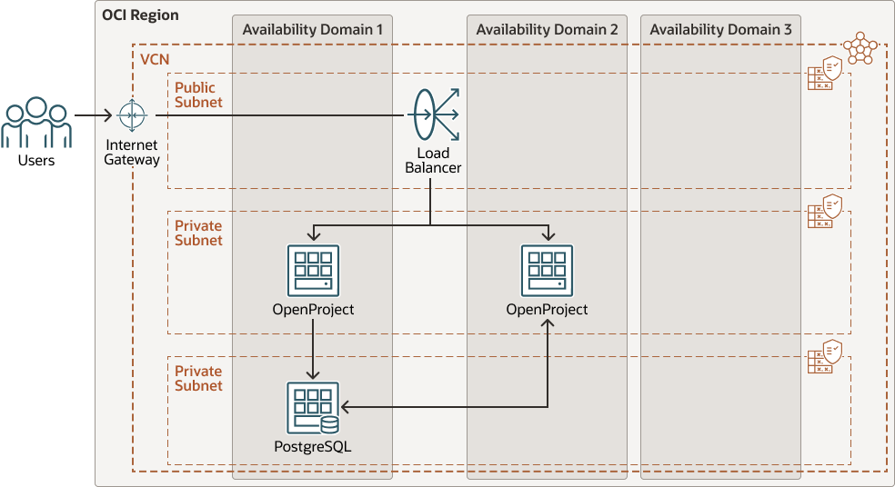

# oci-openproject

[](https://img.shields.io/badge/license-UPL-green) [](https://sonarcloud.io/dashboard?id=oracle-devrel_oci-openproject)

This is Terraform module that deploys OpenSource on Oracle Cloud Infrastructure (OCI).

# About

Deploy an open-source project management software solution to enable your teams to collaborate effectively, while leveraging the infrastructure benefits of Oracle Cloud Infrastructure (OCI).

The OpenProject Community edition is the leading open-source project management software that provides regular updates and new releases for free, released under the GNU General Public License. OpenProject is a powerful open-source project management software that offers several advantages, including:

* Collaboration: OpenProject allows teams to collaborate effectively on projects by providing a centralized platform where they can share information, track progress, and work together on tasks.
* Customization: OpenProject is highly customizable and can be tailored to suit the needs of individual teams or organizations. Users can choose from a range of plugins and add-ons to enhance the functionality of the software.
* Transparency: OpenProject offers transparency by providing real-time updates on the status of projects, including progress, deadlines, and budget. This makes it easy for project managers to stay on top of their projects and make informed decisions.
* Integration: OpenProject integrates seamlessly with other tools and services, such as GitHub, Slack, and Google Drive. This enables teams to work more efficiently and reduces the need for manual data entry.
* Security: OpenProject offers robust security features, including role-based access control and encryption. This ensures that sensitive data is protected from unauthorized access.

# Architecture

You can deploy OpenProject in a single-node configuration, or as part of a multi-node, highly-available configuration. The Terraform code found in GitHub is compatible with both single-node and multi-node configurations. For a production-grade, highly-available architecture, refer to the following diagram, which illustrates a multi-node scenario.

  


# Deploy Using the Terraform CLI

Now, you'll want a local copy of this repo. You can make that with the commands:

```
git clone https://github.com/oracle-devrel/oci-openproject.git
cd oci-openproject
ls
```

# Prerequisites

Create a `terraform.tfvars` file, and specify the following variables:

```
compartment_ocid
region
appvmcount

```

# Create the Resources


Run the following commands:
```
terraform init
terraform plan
terraform apply
```


## Contributing
This project is open source.  Please submit your contributions by forking this repository and submitting a pull request!  Oracle appreciates any contributions that are made by the open source community.

## License
Copyright (c) 2024 Oracle and/or its affiliates.

Licensed under the Universal Permissive License (UPL), Version 1.0.

See [LICENSE](LICENSE) for more details.

ORACLE AND ITS AFFILIATES DO NOT PROVIDE ANY WARRANTY WHATSOEVER, EXPRESS OR IMPLIED, FOR ANY SOFTWARE, MATERIAL OR CONTENT OF ANY KIND CONTAINED OR PRODUCED WITHIN THIS REPOSITORY, AND IN PARTICULAR SPECIFICALLY DISCLAIM ANY AND ALL IMPLIED WARRANTIES OF TITLE, NON-INFRINGEMENT, MERCHANTABILITY, AND FITNESS FOR A PARTICULAR PURPOSE.  FURTHERMORE, ORACLE AND ITS AFFILIATES DO NOT REPRESENT THAT ANY CUSTOMARY SECURITY REVIEW HAS BEEN PERFORMED WITH RESPECT TO ANY SOFTWARE, MATERIAL OR CONTENT CONTAINED OR PRODUCED WITHIN THIS REPOSITORY. IN ADDITION, AND WITHOUT LIMITING THE FOREGOING, THIRD PARTIES MAY HAVE POSTED SOFTWARE, MATERIAL OR CONTENT TO THIS REPOSITORY WITHOUT ANY REVIEW. USE AT YOUR OWN RISK.
